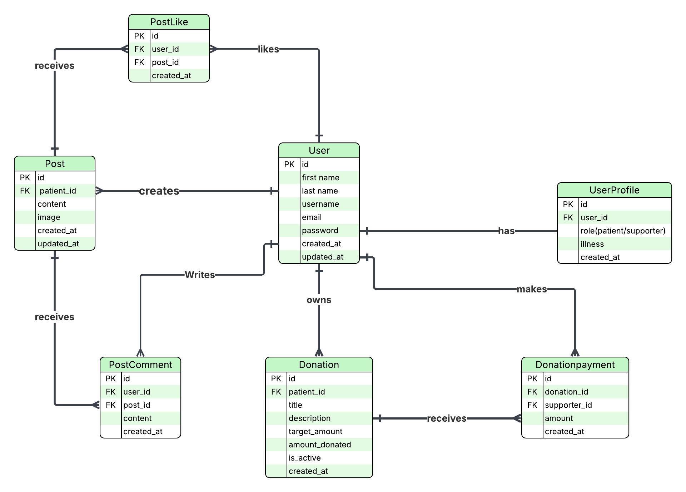

# Albonyan AlMarsous 

## 🌍 About the Project

**Albonyan AlMarsous** is a web application that helps patients share their stories and receive emotional and financial support from others.  
Patients can write posts, create donation campaigns, and communicate with supporters.  
Supporters can view patient posts, leave comments and likes, and donate securely.

This project was built using **React (Vite)** for the frontend and **Django REST Framework** for the backend.

---

## ⚛️ Frontend Tech Stack

### 🖥️ Frontend
- React (Vite)
- JavaScript 
- React Router DOM
- Axios 
- Bootstrap
- Custom CSS 

### ⚙️ Backend
- Django REST Framework
- Python
- PostgreSQL
- JWT Authentication

### 🧰 Dev Tools
- Git & GitHub
- Docker
- Postman

---

## 🔗 Links

- **Backend Repository:** [Albonyan AlMarsous Frontend](https://github.com/alhassan-alshareef/albonyan-almarsous-frontend)

---


## 🗺️ Entity Relationship Diagram (ERD)

The diagram below shows the main models and the relationships between them in the project.



---


---

## 🔗 Links

- **Backend Repository:** [Albonyan AlMarsous Backend](https://github.com/alhassan-alshareef/albonyan-almarsous-backend)

---
## Installation Instructions (Docker)

### 1️⃣ Clone both repositories inside the same parent folder
```bash
parent-folder/
├── Albonyan-AlMarsous-backend/
└── Albonyan-AlMarsous-frontend/
```

### 2️⃣ Clone the backend repository
```bash
git clone https://github.com/YourUsername/Albonyan-AlMarsous-backend.git

```

### 3️⃣ Clone the frontend repository
```bash
git clone https://github.com/YourUsername/Albonyan-AlMarsous-frontend.git

```
### 4️⃣ Run Docker Compose from the backend folder
```bash
cd Albonyan-AlMarsous-backend
docker compose up --build
```

## 📘 What I Learned

- How to connect **React** with **Django REST APIs**  
- How **JWT authentication** works for securing user access  
- How to use **Docker** to run full-stack web applications  
- How to design **clean, reusable React components**  
- How to test and debug APIs using **Postman**

---
## 🧊 Future Ideas

- Add a Patient Appointments Page to show available visiting times.
- Add a Donation Shop Page where patients (or their families) can sell items they no longer need.
- Add Multi-language support (English + Arabic).
- Add an Admin Dashboard 

---
## 👨‍💻 Author

**Alhassan Ali Alshareef**  
Saudi Digital Academy – Software Engineering Bootcamp  


🌐 [GitHub Profile](https://github.com/alhassan-alshareef)
